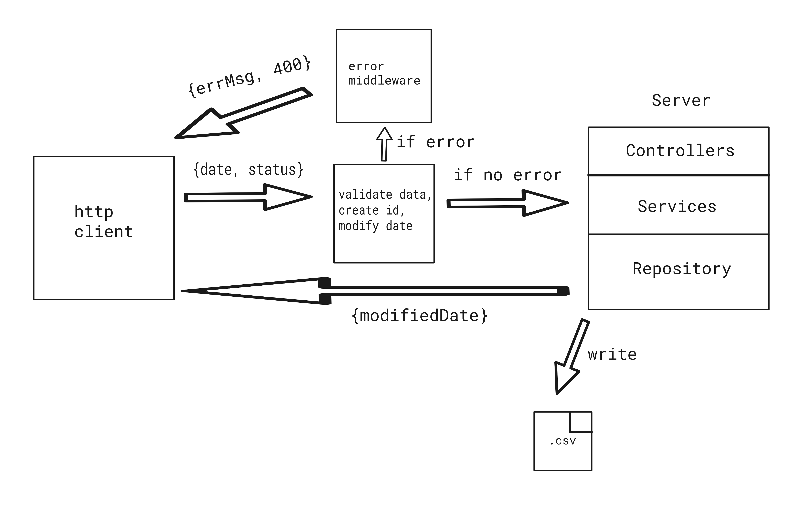
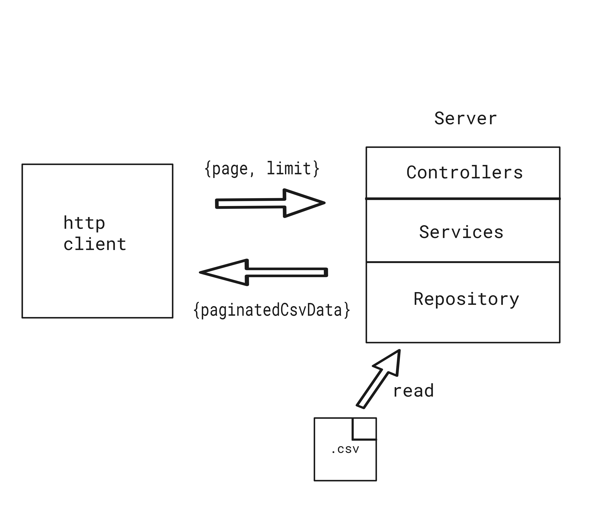

# Transaction managing API

## Description

Simple REST API for transaction handling.

## Table of contents

- [Techstack](#techstack)
- [Requirements](#requirements)
- [Usage](#usage)
- [Postman collection](#postman-collection)
- [Architecture](#architecture)
- [API endpoints](#api)
- [Modify date](#modify-date-helper-function)
- [Tests](#tests)

## Techstack:

- `Express`
- `TypeScript`
- `Jest`

## Requirements:

- `node`
- `http client` for ex. `postman`, `httpie`

## Usage

### Clone repository

```
git clone https://github.com/wojciechszmelczerczyk/ts-transaction-api.git
```

### Navigate to project folder

```sh
cd /ts-transaction-api
```

### Env setup

Create `.env` file in root directory.

```dockerfile
CSV_FILENAME=transactions.csv
```

### Install dependencies

```
npm i
```

### Test function

```
npm run test-function
```

### Run API

```
npm run dev
```

## Postman collection

You can import provided [postman json](./ts-transaction-api.postman_collection.json) and play with api.

## Architecture

User send request with date and status body then express rest api intercept request data, validate, modify date with [modifyDate](/util/modifyDate.ts) function and create random `uuid`. Then with [csv-writer](https://github.com/ryu1kn/csv-writer) library data is save in [transactions.csv](./transactions.csv) file. Server respond with modified date.

<details>
<summary>Example</summary>


</details>

User send request with `page` and `limit` params then express rest api validate those parameters. With [convert-csv-to-json](https://github.com/iuccio/CSVtoJSON) library, `csv` is being converted to `json`. By using [paginatejson](https://github.com/YeisonTapia/paginateJson) library, pagination is made on json data. In the end paginated json data is being converted back to `csv` format [json2csv](http://zemirco.github.io/json2csv) and send back to client.

<details>
<summary>Example</summary>


</details>

## API

| Endpoint           | Method | Description                                                                                                      |
| :----------------- | :----: | ---------------------------------------------------------------------------------------------------------------- |
| `/api/transaction` |  GET   | Get transactions from `.csv` file. User can provide `page` and `limit` query params in order to paginate data\*. |
| `/api/transaction` |  POST  | Add new transaction in `.csv` file and return modified date                                                      |

\* by default `page` is `1` and `limit` is `5`.

## Modify date helper function

Simple function which takes as an input `Date` and transaction status `Boolean` value and returns date in future:

- when boolean is set to `false`, returned date should be 5 days in
  future.
- when boolean is set to `true`, returned date should be month in future.

ex.

### input:

```json
{ "date": "2024-01-31T08:12:59Z", "status": true }
```

### output:

```json
{ "date": "2024-02-29T08:12:59Z" }
```

## Tests

### Run tests

```
npm run unit:service
```

### Transaction Service

### Create transaction

<details>
<summary>when date and status are correct, should create transaction in csv file</summary>

```javascript
const req = {
  id: "58a39e7b-05a3-4daf-a44d-0b264a767ee3",
  date: new Date("2012-01-01"),
};

const body = {
  date: new Date("2012-01-01"),
  status: "true",
};

test("when date and status are correct, should create transaction in csv file", () => {
  expect(
    new TransactionService(new TransactionRepository()).createTransaction(
      req,
      body
    )
  ).toStrictEqual(new Date("2012-02-01T00:00:00.000Z"));
});
```

</details>

<details>
<summary>when status incorrect, should return error message</summary>

```javascript
test("when status incorrect, should return error message", async () => {
  body.status = "";

  const res = await new TransactionService(
    new TransactionRepository()
  ).createTransaction(req, body);

  expect(res).toStrictEqual({
    err: "Bad status type. Status has to be either 'true' or 'false'",
  });
});
```

</details>

### Get transactions

<details>
<summary>when page and limit parameters correct, should return paginated csv</summary>

```javascript
test("when page and limit parameters correct, should return paginated csv", () => {
  const queryParams = {
    page: "1",
    limit: "2",
  };
  const res = new TransactionService(
    new TransactionRepository()
  ).getTransaction(queryParams);

  expect(res).toBeTruthy();
});
```

</details>

<details>
<summary>
when data doesn't exist for provided page and limit parameters, should return error message
</summary>

```javascript
test("when data doesn't exist for provided page and limit parameters, should return error message", () => {
  const queryParams = {
    page: "10000",
    limit: "20000",
  };
  const res = new TransactionService(
    new TransactionRepository()
  ).getTransaction(queryParams);

  expect(res).toStrictEqual({ err: "No data available for this parameters" });
});
```

</details>

<details>
<summary>
when provided page and limit parameters are incorrect, should return error message
</summary>

```javascript
test("when provided page and limit parameters are incorrect, should return error message", () => {
  const queryParams = {
    page: "s",
    limit: "s",
  };
  const res = new TransactionService(
    new TransactionRepository()
  ).getTransaction(queryParams);

  expect(res).toStrictEqual({
    err: "Param has to be positive numeric value",
  });
});
```

</details>
