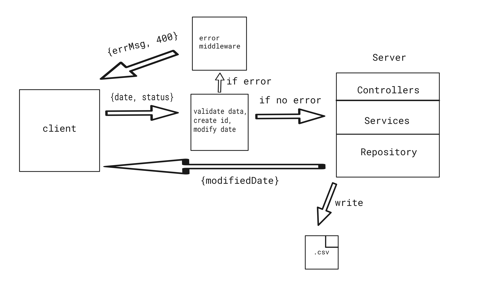

# Transaction managing API

## Description

Simple REST API for transaction handling.

## Table of contents

- [Techstack](#techstack)
- [Requirements](#requirements)
- [Usage](#usage)
- [Architecture](#architecture)
- [API endpoints](#api)
- [Middlewares](#middlewares)
- [Modify date](#modify-date-helper-function)

## Techstack:

- `Express`
- `TypeScript`

## Requirements:

- `node`

## Usage

### Clone repository

```
git clone https://github.com/wojciechszmelczerczyk/ts-date-api.git
```

### Navigate to project folder

```sh
cd /ts-date-api
```

### Install dependencies

```
npm i
```

### Test function

```
npm run test-function
```

### Run API

```
npm run dev
```

## Architecture

API architecture. Example below presents `POST /api/transaction` endpoint flow.



## API

| Endpoint           | Method | Description                                                 |
| :----------------- | :----: | ----------------------------------------------------------- |
| `/api/transaction` |  GET   | Get paginated transactions from `.csv` file                 |
| `/api/transaction` |  POST  | Add new transaction in `.csv` file and return modified date |

## Middlewares

### Data Middleware

Middleware validate data when data is correct, use function from task 1 and modify date. If data isn't correct, pass handler to `Error Handler Middleware` with error.

<details>

<summary>Example</summary>

```javascript
try {
  // intercept date and status from request body
  const { date, status } = req.body;

  // check if status is type "true" | "false"
  if (!isStatusCorrect(status))
    throw new Error(
      "Bad status type. Status has to be either 'true' or 'false'"
    );

  // check if date is date regex
  const isDateValid = moment(date).isValid();

  if (!isDateValid || date === undefined)
    throw new Error("Bad date format. String has to be format date");

  // parse string status to boolean value
  var booleanStatus = status === "true";

  // create mock id
  const id = uuidv4();

  // parse string date into Date object
  const toDate = new Date(date);

  // use function from task 1
  const modifiedDate = modifyDate(toDate, booleanStatus);

  // attach to request object modified date and id
  req.date = modifiedDate;
  req.id = id;

  next();
} catch (err) {
  next(err);
}
```

</details>

### Error handler middleware

When error, return status `400` with error message.

<details>

<summary>
Example
</summary>

```javascript
 error(error: any, req: any, res: Response, next: (err?: any) => any): void {
    res.status(400).json({ err: error.message });
  }
```

</details>

## Modify date helper function

Simple function which takes as an input `Date` and transaction status `Boolean` value and returns date in future:

- when boolean is set to `false`, returned date should be 5 days in
  future.
- when boolean is set to `true`, returned date should be month in future.

ex.

### input:

```json
{ "date": "2024-01-31T08:12:59Z", "status": true }
```

### output:

```json
{ "date": "2024-02-29T08:12:59Z" }
```
