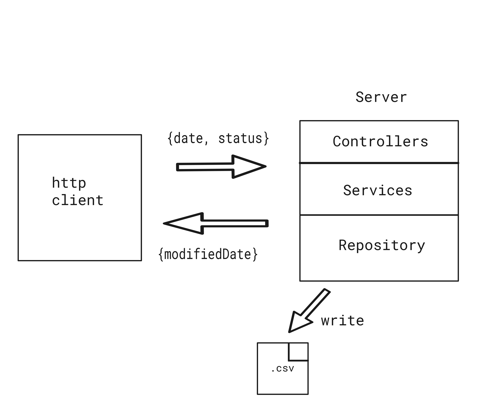
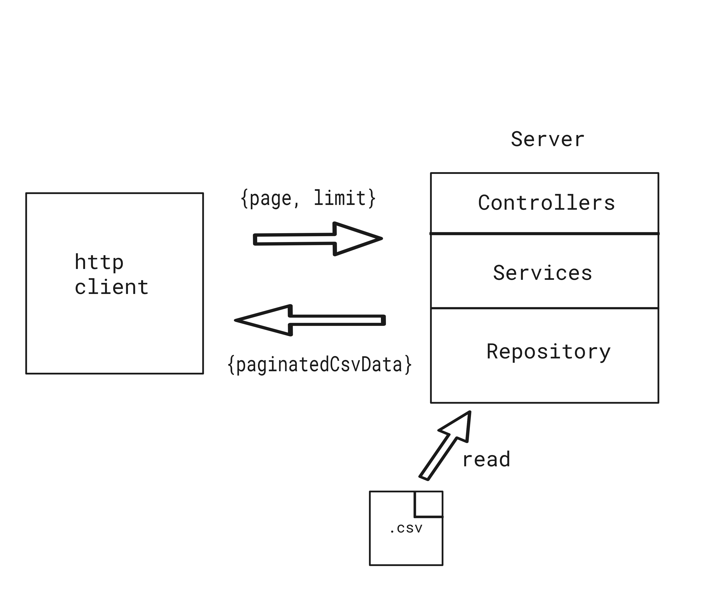

# Transaction managing API

## Description

Simple REST API for transaction handling.

## Table of contents

- [Techstack](#techstack)
- [Requirements](#requirements)
- [Usage](#usage)
- [Postman collection](#postman-collection)
- [Architecture](#architecture)
- [API endpoints](#api)
- [Modify date](#modify-date-helper-function)
- [Tests](#tests)

## Techstack:

- `Express`
- `TypeScript`
- `Jest`

## Requirements:

- `node`
- `http client` for ex. `postman`, `httpie`

## Usage

### Clone repository

```
git clone https://github.com/wojciechszmelczerczyk/ts-transaction-api.git
```

### Navigate to project folder

```sh
cd /ts-transaction-api
```

### Env setup

Create `.env` file in root directory.

```dockerfile
CSV_FILENAME=transactions.csv
```

### Install dependencies

```
npm i
```

### Test function

```
npm run test-function
```

### Run API

```
npm run dev
```

## Postman collection

You can import provided [postman json](./ts-transaction-api.postman_collection.json) and play with api.

## Architecture

### Introduction

Library used to develop app architecture [routing-controllers](https://github.com/typestack/routing-controllers). REST API using `Controller`, `Service` and `Repository` approach.

### POST /api/transaction

User send request with date and status body then express rest api intercept request data, validate date with [moment](https://github.com/moment/moment) library, status with [isStatusCorrect](./utils/isStatusCorrect.ts) function, modify date with [modifyDate](/util/modifyDate.ts) function and create random `uuid`. Then with [csv-writer](https://github.com/ryu1kn/csv-writer) library data is save in [transactions.csv](./transactions.csv) file. Server respond with modified date.

<details>

<summary>Example</summary>


</details>
<br/>

### GET /api/transaction

User send request with `page` and `limit` query params then express rest api validate those parameters with [validateParams](./utils/validateParams.ts) function. With [convert-csv-to-json](https://github.com/iuccio/CSVtoJSON) library, `csv` is being converted to `json`. By using [paginatejson](https://github.com/YeisonTapia/paginateJson) library, pagination is made on json data. In the end paginated json data is being converted back to `csv` format [json2csv](http://zemirco.github.io/json2csv) and send back to client.

<details>
<summary>Example</summary>


</details>

<br/>

## API

| Method |               Endpoint               |
| :----: | :----------------------------------: |
|  POST  | [`/api/transaction`](./docs/post.md) |
|  GET   | [`/api/transaction`](./docs/get.md)  |

## Modify date helper function

Simple function which takes as an input `Date` and transaction status `Boolean` value and returns date in future:

- when boolean is set to `false`, returned date should be 5 days in
  future.
- when boolean is set to `true`, returned date should be month in future.

ex.

### input:

```json
{ "date": "2024-01-31T08:12:59Z", "status": true }
```

### output:

```json
{ "date": "2024-02-29T08:12:59Z" }
```

## Tests

### Run tests

```
npm run test:api
```

### Transaction

### POST /api/transaction

<details>
<summary>when date correct and status true, should return date month in future</summary>

```javascript
test("when date correct and status true, should return date month in future", async () => {
  const res = await request(app)
    .post("/api/transaction")
    .send({ date: "2012-02-02", status: "true" });

  expect(new Date(res.body.modifiedDate)).toStrictEqual(new Date("2012-03-02"));
});
```

</details>

<details>
<summary>when date correct and status false, should return date 5 days in future</summary>

```javascript
test("when date correct and status false, should return date 5 days in future", async () => {
  const res = await request(app)
    .post("/api/transaction")
    .send({ date: "2012-02-02", status: "false" });

  expect(new Date(res.body.modifiedDate)).toStrictEqual(new Date("2012-02-07"));
});
```

</details>

<details>
<summary>
when date incorrect, should return error message
</summary>

```javascript
test("when date incorrect, should return error message", async () => {
  const res = await request(app)
    .post("/api/transaction")
    .send({ date: 2, status: "true" });

  expect(res.body).toStrictEqual({
    err: "Bad date format. String has to be date format",
  });
});
```

</details>
<details>
<summary>when status incorrect, should return error message</summary>

```javascript
test("when status incorrect, should return error message", async () => {
  const res = await request(app)
    .post("/api/transaction")
    .send({ date: "2012-02-02", status: "x" });

  expect(res.body).toStrictEqual({
    err: "Bad status type. Status has to be either 'true' or 'false'",
  });
});
```

</details>

### GET /api/transaction

<details>
<summary>when page and limit query params correct, should return records specific for params</summary>

```javascript

```

</details>

<details>
<summary>when query params exceed number of transactions, should return error message</summary>

```javascript
test("when query params exceed number of transactions, should return error message", async () => {
  const res = await request(app)
    .get("/api/transaction")
    .query({ page: "1000", limit: "2000" });

  expect(res.body.err).toBe("No data available for this parameters");
});
```

</details>

<details>
<summary>
when no query params provided, should return first 5 records
</summary>

```javascript

```

</details>
<details>
<summary>when one of provided parameters incorrect, should return error message</summary>

```javascript
test("when one of provided parameters incorrect, should return error message", async () => {
  const res = await request(app)
    .get("/api/transaction")
    .query({ page: "x", limit: "2" });

  expect(res.body.err).toBe(
    "Page and limit have to be positive numeric values"
  );
});
```

</details>
